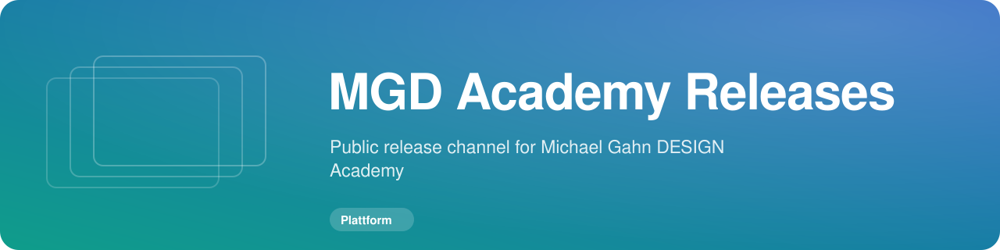

<!-- MGD-HEADER -->

  
  
  

<!-- /MGD-HEADER -->

# MGD Academy Releases

Öffentlicher Release-Kanal für die **Michael Gahn DESIGN Academy**.

Dieses Repository enthält ausschließlich fertige Installationspakete, Update-Archive, Prüfsummen und Release Notes. Der Quellcode der MGD Academy und persönliche Nutzerdaten werden hier nicht gespeichert.

## macOS Installation

1. Lade die aktuelle Datei `MGD-Academy-X.Y.Z-macOS.dmg` aus dem neuesten Release herunter.
2. Öffne die DMG.
3. Ziehe **MGD Academy** in den Ordner **Applications / Programme**.
4. Öffne anschließend **MGD Academy** aus dem Programme-Ordner.

## macOS blockiert die App beim ersten Start

Die aktuelle Vorabversion ist noch nicht vollständig mit einer Apple Developer ID signiert und notarisiert. Deshalb kann macOS beim ersten Start melden, dass **„MGD Academy.app“ blockiert wurde, um deinen Mac zu schützen**.

Das ist bei dieser Vorabversion erwartet.

### Schritt für Schritt freigeben

1. Versuche **MGD Academy** einmal normal zu starten.
2. Öffne danach **Systemeinstellungen**.
3. Öffne **Datenschutz & Sicherheit**.
4. Scrolle rechts nach unten zum Abschnitt **Sicherheit**.
5. Dort sollte ein Hinweis zu **MGD Academy.app** erscheinen.
6. Klicke auf **Dennoch öffnen**.
7. Bestätige die anschließende Sicherheitsabfrage mit **Öffnen**.
8. Falls macOS danach fragt, bestätige den Vorgang mit deinem Mac-Passwort oder Touch ID.
9. Starte **MGD Academy** anschließend erneut aus dem Ordner **Programme**.

Diese Freigabe ist normalerweise nur beim ersten Start notwendig.

> Wichtig: Führe diesen Schritt nur aus, wenn du die App direkt aus diesem offiziellen Repository heruntergeladen hast.

## Warum ist dieser Schritt notwendig?

Die Academy wird derzeit außerhalb des Mac App Store verteilt und ist in dieser Entwicklungsphase noch nicht vollständig durch Apples Signierungs- und Notarisierungsprozess gegangen.

Für eine spätere öffentliche Produktversion ist eine vollständige Apple Developer ID Signierung und Notarisierung vorgesehen. Dann soll die zusätzliche Freigabe unter **Datenschutz & Sicherheit** entfallen.

## Automatische Updates

Ab Version **0.3.3** liest die Academy direkt die GitHub Releases dieses Repositories.

Wenn ein neueres Release verfügbar ist, kann die App:

* die neue Version erkennen
* Release Notes und Neuerungen anzeigen
* das passende Updatepaket herunterladen
* die SHA256-Prüfsumme kontrollieren
* einen Update-Splashscreen anzeigen
* die App aktualisieren
* die Academy anschließend automatisch neu starten

Zusätzlich kann jederzeit manuell geprüft werden unter:

**Einstellungen → Updates → Nach Updates suchen**

## Release-Pakete

macOS Releases enthalten normalerweise:

* `MGD-Academy-X.Y.Z-macOS.dmg` für die Erstinstallation
* `MGD-Academy-X.Y.Z-macOS-update.zip` für automatische In-App-Updates
* SHA256-Prüfsummen

Windows-Pakete folgen später.
